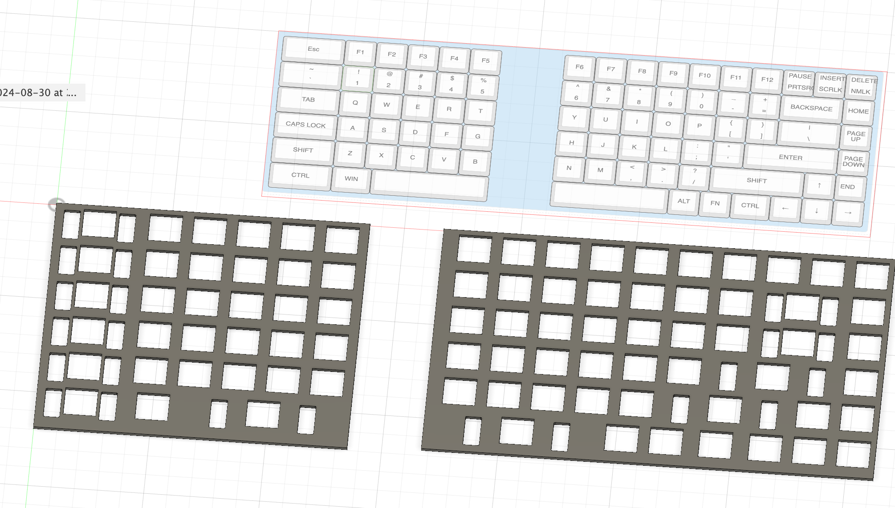

# Plan
make a ortholinear split keyboard mostly from scratch. (buying switches and stabs)
## the process
- keyboard-layout-editor.com
  - current layout (kle): ```[{a:7,w:2},"Esc","F1","F2","F3","F4","F5",{x:2},"F6","F7","F8","F9","F10","F11","F12",{a:5},"PAUSE\nPRTSRC","INSERT\nSCRLK","DELETE\nNMLK"],
[{w:2},"~\n`","!\n1","@\n2","#\n3","$\n4","%\n5",{x:2},"^\n6","&\n7","*\n8","(\n9",")\n0","_\n-","+\n=",{a:7,w:2},"BACKSPACE","HOME"],
[{w:2},"TAB","Q","W","E","R","T",{x:2},"Y","U","I","O","P",{a:5},"{\n[","}\n]",{w:2},"|\n\\",{a:7},"PAGE UP"],
[{w:2},"CAPS LOCK","A","S","D","F","G",{x:2},"H","J","K","L",{a:5},":\n;","\"\n'",{a:7,w:3},"ENTER","PAGE DOWN"],
[{w:2},"SHIFT","Z","X","C","V","B",{x:2},"N","M",{a:5},"<\n,",">\n.","?\n/",{a:7,w:3},"SHIFT","↑",{a:6},"END"],
[{a:7,w:2},"CTRL",{w:1.25},"WIN",{w:3.75},"",{x:2,w:3.75},"","ALT","FN",{w:1.25},"CTRL","←","↓","→"]```

- https://kbplate.ai03.com/
  - makes a dxf from the kle file for Fusion360
    - the line are all separate, so you have to go over them a second time
    - still very useful tool nonetheless




- dont know how Im going to design or manufacture the pcb yet
  - [manufacturing website](https://www.elecrow.com/). dci lab reccomends outsourcing for througholes
  - 2 boards (one for each half). Do I need more?
  - can I work backwards from the plate design?
  - what is the differnce from Mill-Max vs Sockets
    - will it require a cherry layout anyway
  - how to add LEDs
https://www.youtube.com/watch?v=fYNxG8RwpaE

- **Look into using I2C protcol**
- each half needs rows + columns pins
  - left: r:6,c:6. right: r:6,c:10
    - so i think i need a board with at least 28 pins (this isnt including LED controlling)
    - need to pass through at least 12 data pins if going from l->r
  - maybe get a larger mircocontroller and pass through the other half
  - controllers
    - [32 gpio pins](https://www.amazon.com/AITRIP-ESP-WROOM-32-Development-Microcontroller-Integrated/dp/B0B764963C)
    - [3 * 16 pins](https://www.amazon.com/Teyleten-Robot-Bootloadered-Development-Microcontroller/dp/B08THVMQ46)
## CAD notes
- Keyboard CAD dimensions for holes
  - https://null-src.com/posts/keyboard-design-cheatsheet/
- as of now the keys are 5.05mm x, and 5mm y. offset
- the CAD file will have offsets fot the pcb and case border
- bridge wire goes out of the north sides
  - magnets on the inside so it can be a regular ortho
- *Make sure that the the the gap is the same when the boards are combined*
  - needs to be 5.05mm total, so each inner half is 2.5025mm
- detachable ramps on the bottom for tilt
  - magnets inside the rubber feet
  - adjustable??

- pcb needs to be designed for Cherry MX hotswap holes

- keycaps
  - [parametric keycap generator](https://github.com/rsheldiii/KeyV2)

## Assembly notes
- how to add hotswap sockets to a board
  - [tutorial](https://www.youtube.com/watch?v=RB1Wm8y2Cw8)
  - [mx sockets](https://www.amazon.com/DUROCK-Mechanical-Keyboard-Switches-Hot-Swap/dp/B0B4W9YMGM/)

## Purchasing notes
- anything 2u and larger needs a stab. total stabs: 12 
  - 2u: backspace, backslash
  - 3u: enter, shift_R
  - 3.75u: space (2)
  - esc, tilde, tab, caps lock, shift_L, ctrl
    - i dont know if i want these 2u or 1.5u yet

- types of stabs
  - plate goes onto the grid (if no pcb)
  - screw in (best kind, but needs holes in pcb before)

- switches
  - [zilents](https://zealpc.net/products/zilent?variant=5894817710118)
  - [pegasus](https://www.amazon.com/GK-GAMAKAY-Mechanical-Keyboard-Keyboards/dp/B0BFBLTX98/?th=1)
  - [boba rgb](https://www.aliexpress.us/item/3256804714915959.html?spm=a2g0o.productlist.main.1.1e712746Y755Sw&algo_pvid=9de6a71c-b731-4320-a16d-9efd6f5a6c61&algo_exp_id=9de6a71c-b731-4320-a16d-9efd6f5a6c61-0&pdp_npi=4%40dis%21USD%2165.90%2156.90%21%21%2165.90%2156.90%21%402101e63417250840101823035e137a%2112000030956123791%21sea%21US%210%21ABX&curPageLogUid=YjX9CKdy7qos&utparam-url=scene%3Asearch%7Cquery_from%3A)
  - [boba black](https://www.aliexpress.us/item/3256804453022522.html?spm=a2g0o.productlist.main.3.1e712746Y755Sw&algo_pvid=9de6a71c-b731-4320-a16d-9efd6f5a6c61&algo_exp_id=9de6a71c-b731-4320-a16d-9efd6f5a6c61-1&pdp_npi=4%40dis%21USD%2166.00%2157.00%21%21%2166.00%2157.00%21%402101e63417250840101823035e137a%2112000029934907516%21sea%21US%210%21ABX&curPageLogUid=jnjc5mLhVR8d&utparam-url=scene%3Asearch%7Cquery_from%3A)
  - [WS](https://www.amazon.com/Keyboard-Switches-Tactile-Mechanical-Compatible/dp/B0CYLLDC1L/)

# Milestones

- [ ] finish plate CAD
- [ ] finish pcb CAD
- [ ] finish keycaps CAD
- [ ] finish case CAD

- [ ] buy switches
- [ ] buy hotswap sockets
- [ ] print plate
- [ ] test fit switches with plate
- [ ] buy micro controllers
